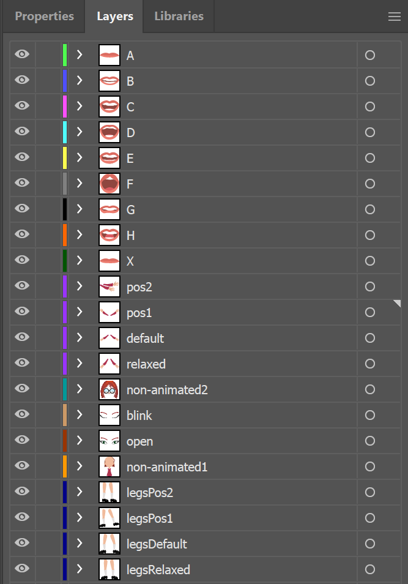
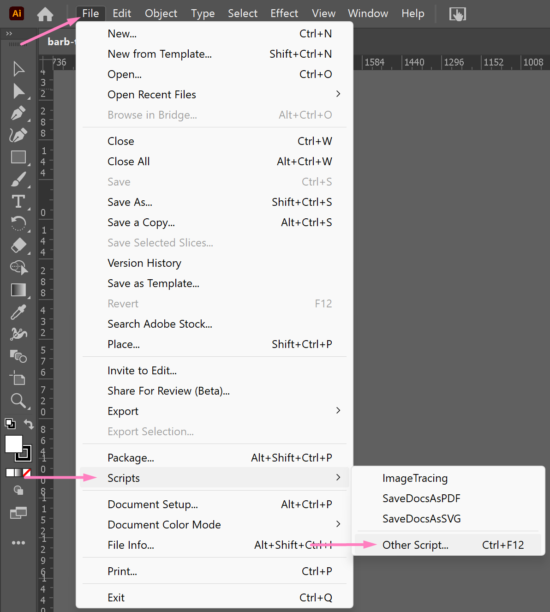

# Avatar Image Tooling

> **Please note that tooling is meant for internal use only**

## What it Does

The tooling programmatically generates the images required for the animation process by looping through layers and
toggling visibility.

## Usage

This script can be run by going to Illustrator -> File -> Scripts -> Browse & selecting this script. you will also have
to update the file path based on your system. This update is to be done on line 50.

## Proper File Setup

In order for the illustrator script to run properly, it is necessary that the layers are set up in a similar fashion to
what is shown in the attached image.

Once that is completed, your Illustrator file is considered properly setup. If you require additional clarity, please
view [the Illustrator file within the repository](../../speaking-portal-project/images/barb-tooling.ai) and set up your file in an identical manner.

## Running the Script

[This script](../../speaking-portal-project/tooling/frameGeneratorScript.jsx) can be run by going to Illustrator -> File -> Scripts -> Browse & selecting this script.

## Generating New Animations

In order to generate new animations, you will need to create new layers for different poses. Once the layers are created
you will need to update the arrays which corresponds to the body part, as well as the toggleable layers array. For
example, if you had a new arm pose to add, you would need to update the arms array with the name of the new layer, and
then do the same for the ToggleableLayer array.
