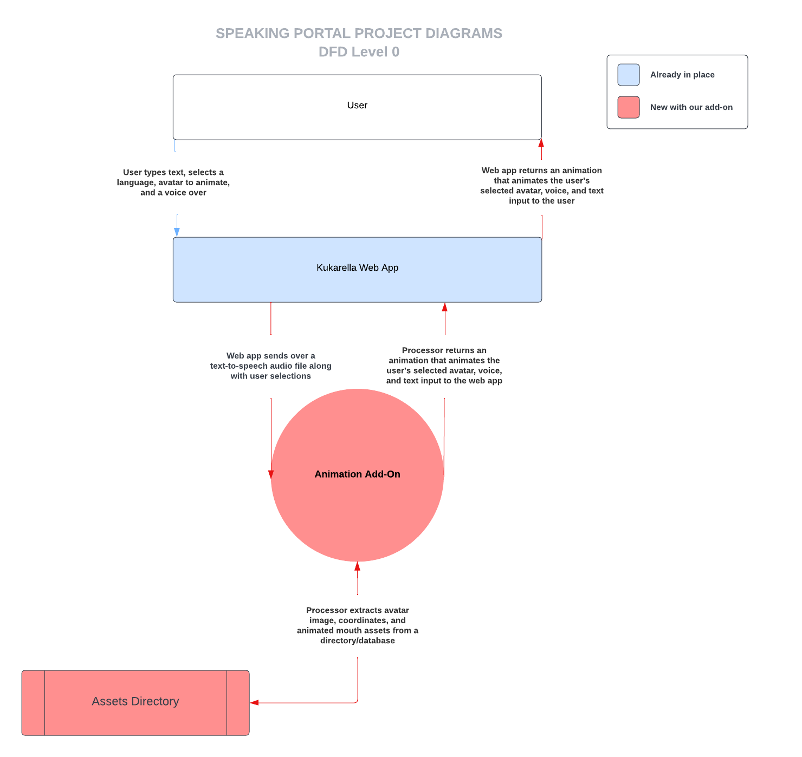
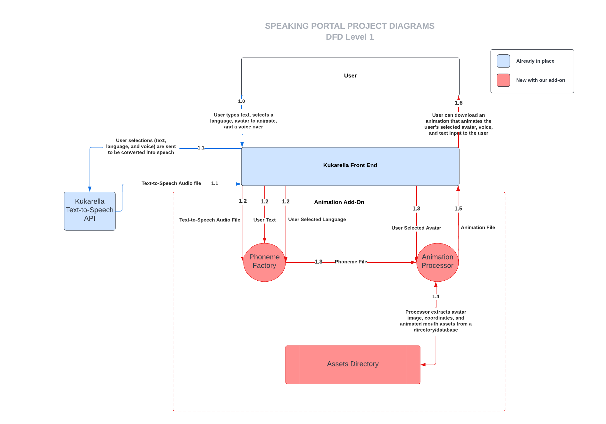

# Data Flow Diagrams

These diagrams are generalizations about how our system will interact with data from the user, Kukarella Web App, and our Animation Add-On. The level 0 DFD highlights a high overview of the system and the level 1 DFD breaks down the system in more detail. The system we are building is working alongside an existing system. Items highlighted in red represent the parts of the system that are already in place and items highlighted in blue  are parts of the system that are being added by our new Animation Add-On.

## Level 0 

The level 0 data flow diagrams give a high level view of how our system will be interacting with the user and the client’s existing system. 

The user will first access Kukurella’s text-to-speech front end and type in a text input. The user will also select a voice and an avatar they would like to use for their text-speech animation. From the front-end the text and other user selections will be sent over to our Animation Add-On. The Animator will then query an avatar image, avatar coordinates, and mouth animation assets from a database. The Animator will produce an animation of an avatar reading the user’s text in the user selected voice. This animation will be sent to Kukeralla's web application and then will be sent to the user.  

## Level 1

The level 1 DFD provides a more detailed breakdown of the data flow between the client’s system and the Animation Add-On.

In this diagram Kukeralla’s Web application is broken down into a front-end and a text-to-speech API. The Kurkarella text-to-speech API creates the synthesized speech file from the user’s voice and text input. The Animation add-on is broken down into two main components. The phoneme factory is in charge of mapping spoken language from an audio file into a series of phonemes. In order to make this process as accurate as possible the phoneme factory also receives the user text file and language selection. Once the phoneme file is created it is sent off to a secondary process called the phoneme processor. This processor maps phonemes from the phoneme file to mouth assets received from a directory. There will be 1:1 mapping between phonemes and mouth assets. These assets will be added onto the avatar and rendered into a video file. The video file will be sent back to the front-end and available for the user to download onto their local machine.

